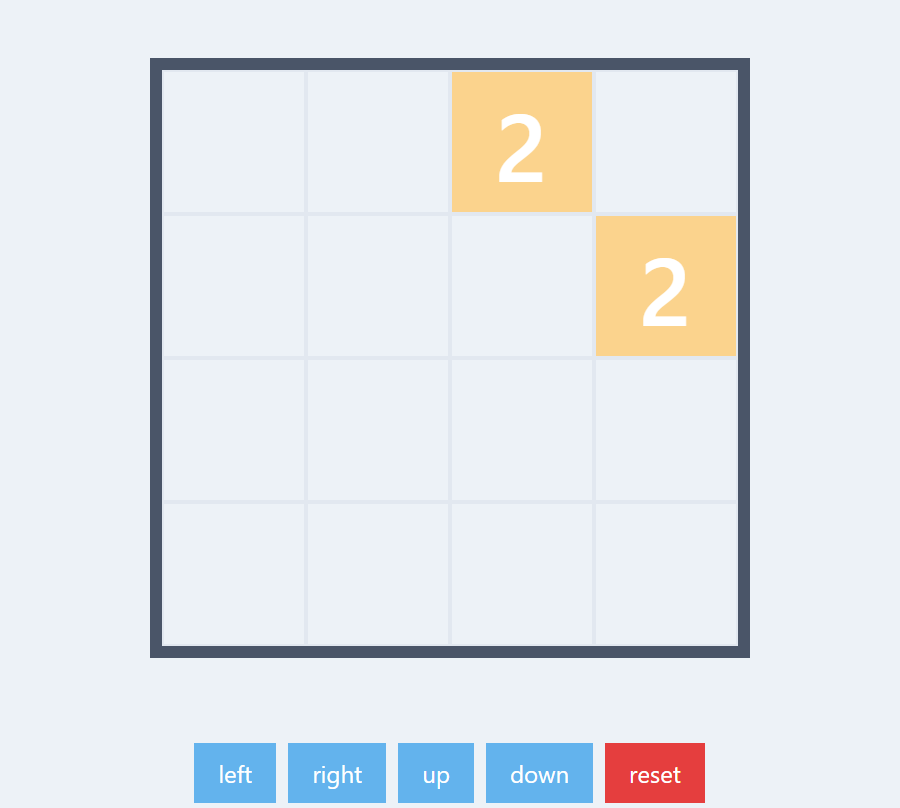

# 2048

Learning reactjs and tailwindcss by creating a game.
[check it out here!](https://junhyukhan.netlify.app/)
The game is probably still buggy at best and there are many features that aren't implemented. So treat it with caution when trying it out :sweat_smile:

If you're reading this, my guess is that you most definitely know the game by now, but if not, this is a copy of the famous [2048 game](https://gabrielecirulli.github.io/2048/) by Gabriele Cirulli. 
Go check it!

The layout/style/ui is subject to change but here is a screenshot of the game:

